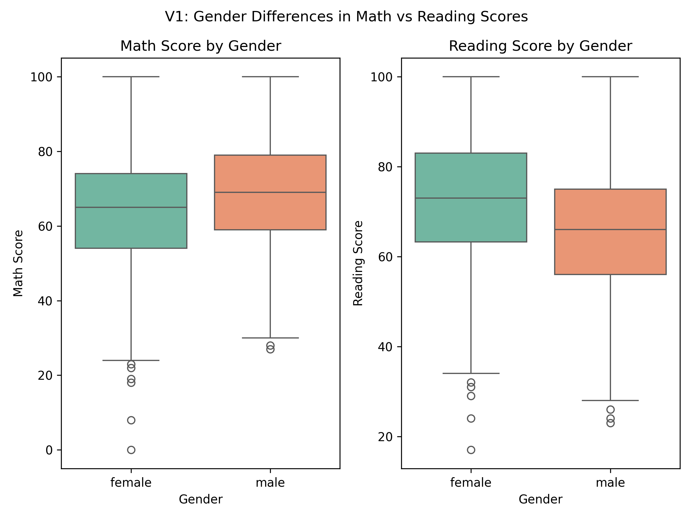
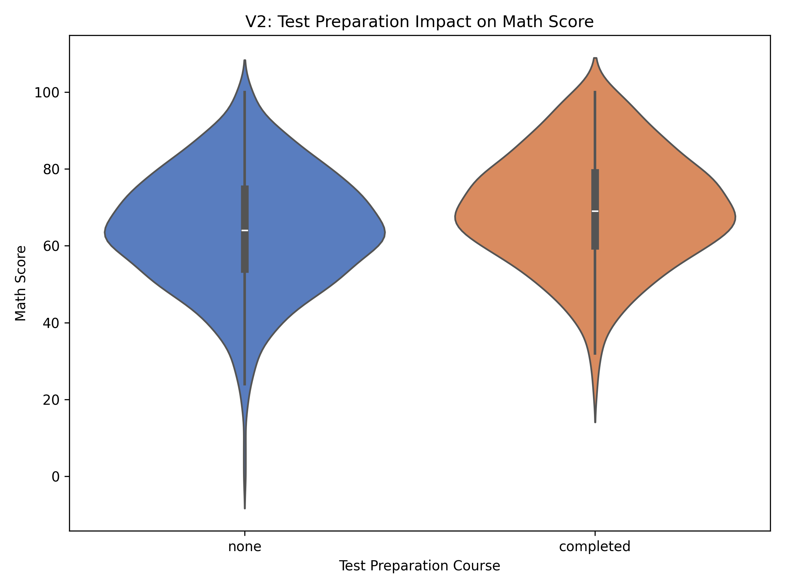
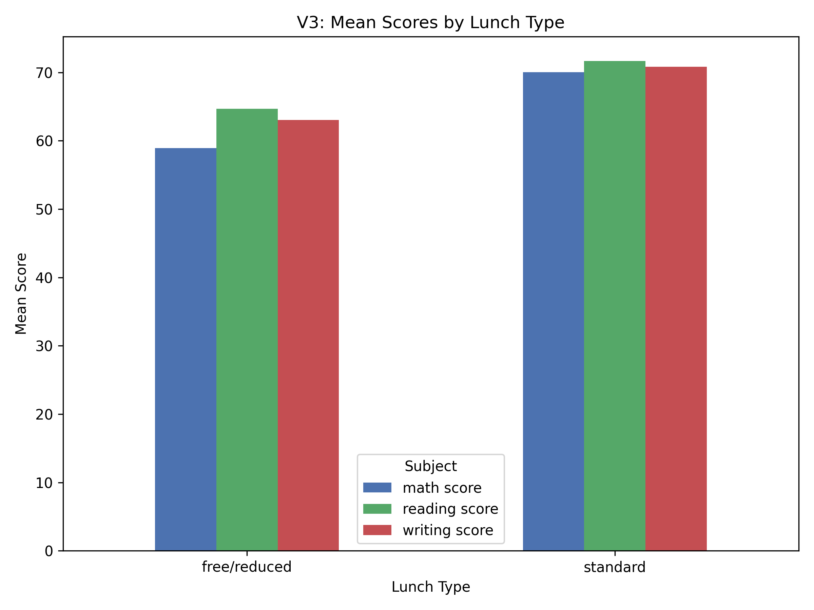
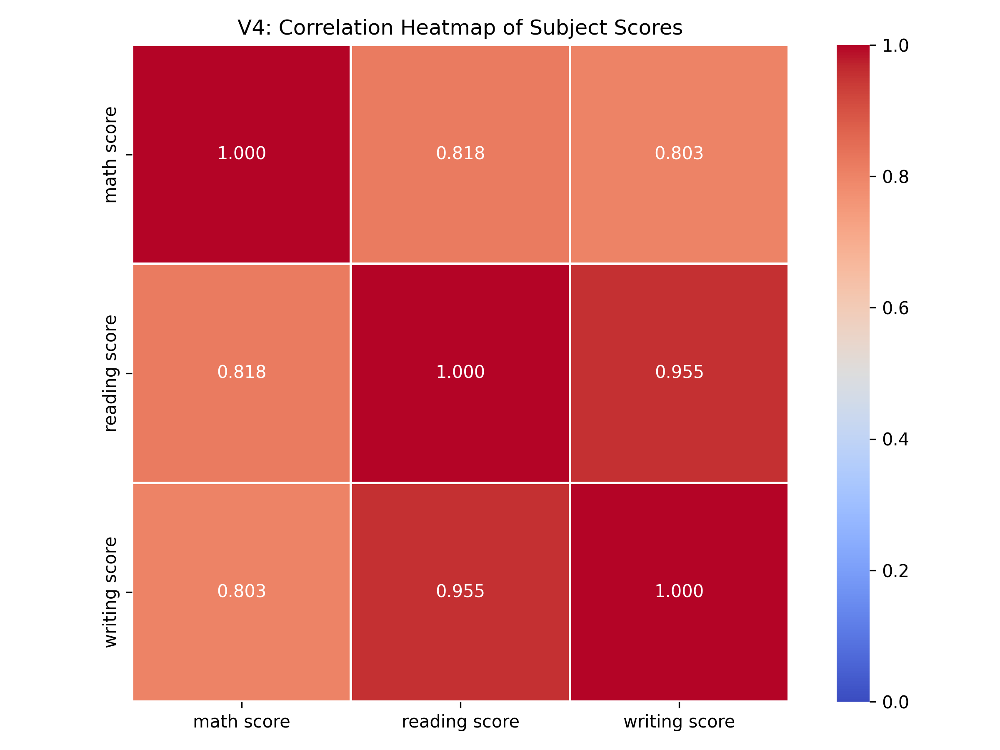
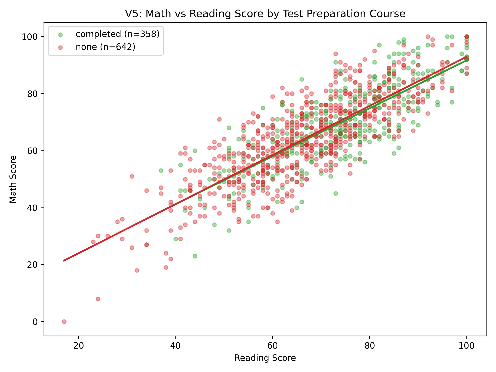

# CS 5530 — Assignment 1

## Setup

```bash
pip install pandas numpy matplotlib seaborn
```

---

## Q1: Frailty & Grip Strength Analysis (10 pts)

A three-stage pipeline (ingest → process → analyze) on grip strength data from 10 female participants.

**Run:**
```bash
cd q1
jupyter notebook analysis.ipynb
```

### Pipeline

1. **Ingest** — Load raw CSV into pandas
2. **Process** — Unit conversion (in→m, lb→kg), BMI, AgeGroup binning, Frailty binary + one-hot encoding
3. **Analyze** — Summary statistics + correlation

### Findings

| Metric | Height (m) | Weight (kg) | BMI | Grip Strength (kg) | Frailty |
|--------|-----------|-------------|------|--------------------:|--------:|
| Mean   | 1.7424    | 59.8288     | 19.68 | 26.00             | 0.40    |
| Median | 1.7386    | 61.6886     | 19.19 | 27.00             | 0.00    |
| Std    | 0.0424    | 6.4554      | 1.78  | 4.52              | 0.52    |

**Correlation (Grip Strength ↔ Frailty): −0.4759**

The negative correlation confirms that lower grip strength is associated with higher frailty, consistent with clinical literature. Participants classified as frail tend to have weaker grip strength.

---

## Q2: Student Performance EDA & Visualizations (10 pts)

Exploratory analysis of a 1,000-student performance dataset with 5 visualizations.

**Run:**
```bash
cd q2
jupyter notebook analysis.ipynb
```

### V1 — Gender Differences in Math vs Reading



Male students have a higher median math score (69.0) compared to females (65.0). Females score higher in reading (median 73.0 vs 66.0). The spread is similar for both genders. This suggests gender-based differences in subject strengths, though the overlap is substantial — gender alone is not a strong predictor.

### V2 — Test Prep Impact on Math



Students who completed test prep scored higher in math (mean 69.7 vs 64.1). The violin plot shows a denser concentration of higher scores in the completed group. Test prep shifts the distribution upward by ~5.6 points on average, though some unprepared students still scored very high.

### V3 — Lunch Type and Average Performance



Standard lunch students outperform free/reduced lunch students across all subjects (overall avg 70.8 vs 62.2). The ~8.6 point gap is consistent across math, reading, and writing. Lunch type serves as a proxy for socioeconomic status, suggesting background has a noticeable impact on performance.

### V4 — Subject Correlations



Reading and writing have the highest correlation (0.955) — both are language-based skills. Math correlates moderately with reading (0.818) and writing (0.803). All three subjects move together positively; no trade-off exists between them.

### V5 — Math vs Reading with Trend Lines by Test Prep



Both groups show a clear positive association between math and reading. The completed group (n=358, slope=0.840) and none group (n=642, slope=0.861) have nearly identical slopes. Test prep's main effect is an upward intercept shift rather than a change in the math-reading relationship.

---

## Dependencies

- Python 3.10+
- pandas, numpy, matplotlib, seaborn, jupyter
